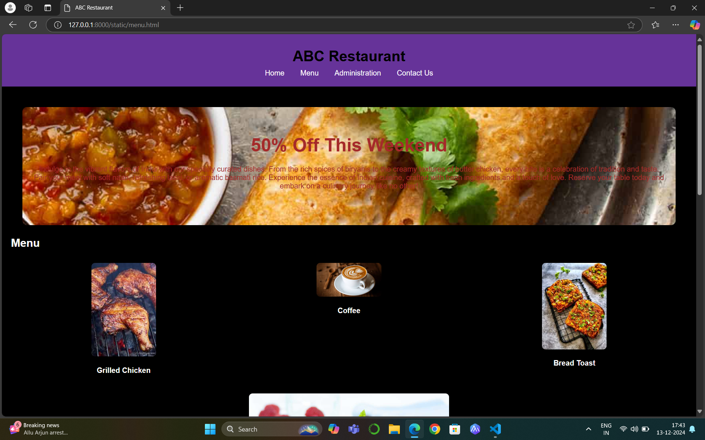
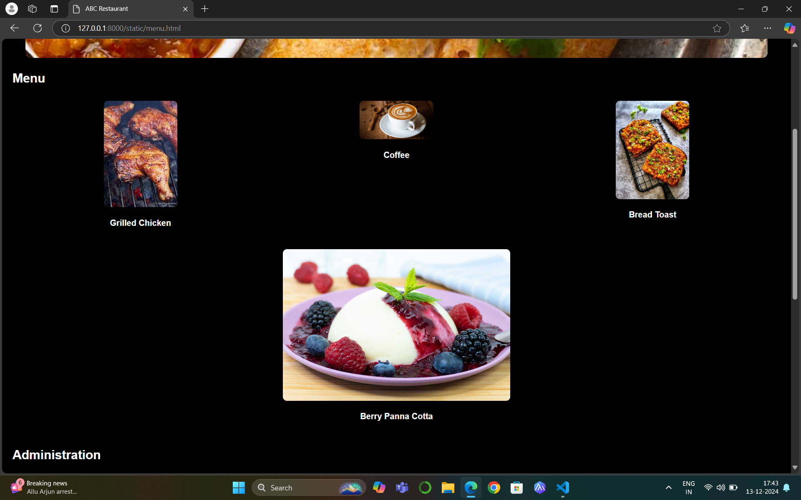
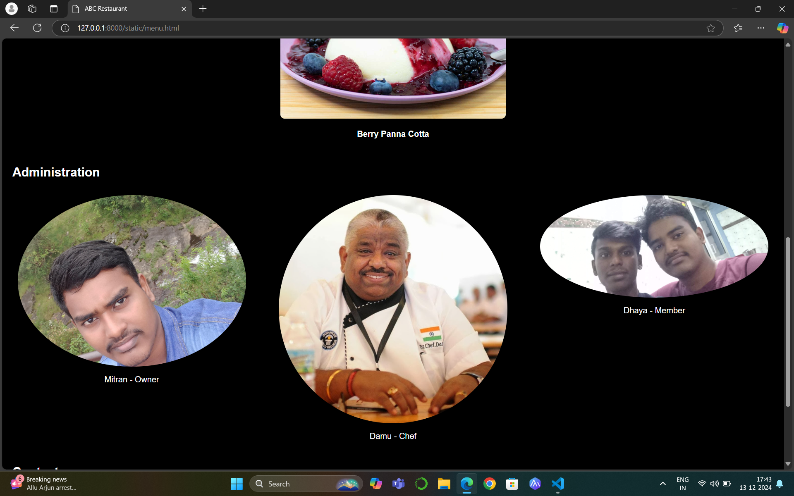
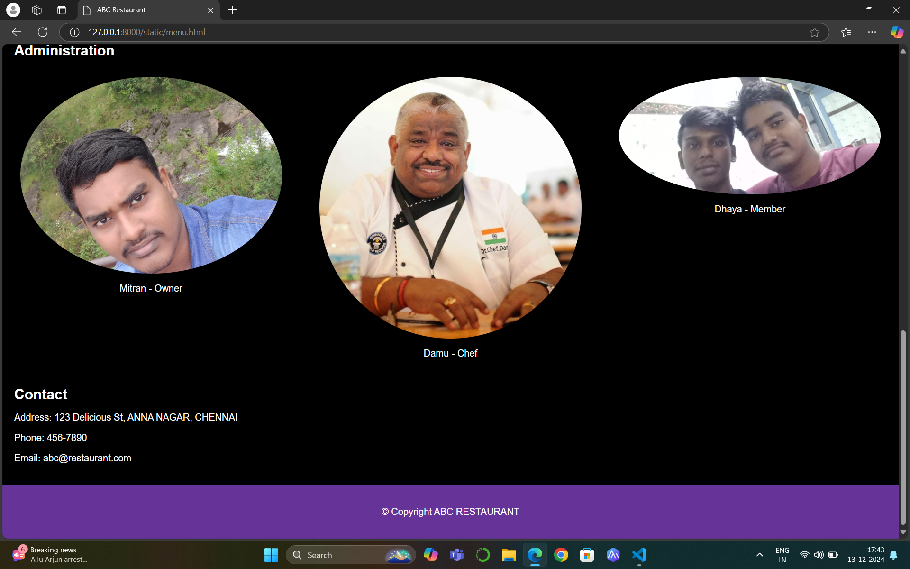

# Ex.07 Restaurant Website
## Date:11-12-2024

## AIM:
To develop a static Restaurant website to display the food items and services provided by them.

## DESIGN STEPS:

### Step 1:
Requirement collection.

### Step 2:
Creating the layout using HTML and CSS.

### Step 3:
Updating the sample content.

### Step 4:
Choose the appropriate style and color scheme.

### Step 5:
Validate the layout in various browsers.

### Step 6:
Validate the HTML code.

### Step 7:
Publish the website in the given URL.

## PROGRAM:
```
<html>
<head>
    <title>ABC Restaurant</title>
    <style>
        * {
            box-sizing: border-box;
        }

        html, body 
        {
            height: 100%;
            margin: 0;
            font-family: Arial, sans-serif;
            background-color: black;
            color: white;
        }

        .container 
        {
            display: flex;
            flex-direction: column;
            min-height: 100vh;
        }

        header 
        {
            background-color: rebeccapurple;
            color: black;
            padding: 20px;
            text-align: center;
        }

        .banner 
        {
            text-align: center;
            background: url('banner.jpg') no-repeat center center/cover;
            padding: 60px 20px;
            color: brown;
            border-radius: 10px;
            margin: 25px;
        }

        .banner h2 
        {
            font-size: 2.5em;
            margin: 0 0 20px;
        }

        nav ul 
        {
            list-style: none;
            padding: 0;
            margin: 0;
        }

        nav ul li 
        {
            display: inline;
            margin: 0 15px;
        }

        nav ul li a 
        {
            color: white;
            text-decoration: none;
        }

        
        h1, h2 
        {
            margin: 10px 0;
        }

        
        main 
        {
            flex: 1;
            padding: 20px;
        }


        .team 
        {
            display: flex;
            flex-wrap: wrap;
            justify-content: space-between;
            margin: 20px 0;
        }

        .member 
        {
            width: 30%;
            margin: 10px;
            text-align: center;
        }

        .member img 
        {
            width: 100%;
            height: auto;
            border-radius: 50%;
        }

        
        .menu-items 
        {
            display: flex;
            flex-wrap: wrap;
            justify-content: space-between;
            margin: 20px 0;
        }

        .food-item 
        {
            flex: 1 1 calc(33.333% - 20px); /* Ensures three items per row with spacing */
            margin: 10px;
            text-align: center;
        }

        .food-item img 
        {
            width: 30%;
            height: auto;
            border-radius: 8px;
        }

        
        footer 
        {
            text-align: center;
            padding: 20px;
            background-color: rebeccapurple;
            color: white;
        }
    </style>
</head>
<body>
    <div class="container">
        <header>
            <h1>ABC Restaurant</h1>
            <nav>
                <ul>
                    <li><a href="index.html">Home</a></li>
                    <li><a href="menu.html">Menu</a></li>
                    <li><a href="administration.html">Administration</a></li>
                    <li><a href="contact.html">Contact Us</a></li>
                </ul>
            </nav>
        </header>
        <main>
            <section class="banner" style="background-image: url('Dosa.jpg');">
                <h2 class="offer-txt">50% Off This Weekend</h2>
                <p class="offer-txt">Indulge in the vibrant flavors of India with our specially curated dishes. From the rich spices of biryanis to the creamy textures of butter chicken, every bite is a celebration of tradition and taste. Pair your meal with soft naan, refreshing lassi, or aromatic basmati rice. Experience the essence of Indian cuisine, crafted with fresh ingredients and a touch of love. Reserve your table today and embark on a culinary journey like no other!</p>
            </section>
            <h2>Menu</h2>
            <section class="menu-items">
                <div class="food-item">
                    
                    <h4>Grilled Chicken</h4>
                </div>
                <div class="food-item">
                    
                    <h4>Coffee</h4>
                </div>
                <div class="food-item">
                    
                    <h4>Bread Toast</h4>
                </div>
                <div class="food-item">
                    
                    <h4>Berry Panna Cotta</h4>
                </div>
            </section>
            <h2>Administration</h2>
            <div class="team">
                <div class="member">
                    
                    <p>Mitran - Owner</p>
                </div>
                <div class="member">
                    
                    <p>Damu - Chef</p>
                </div>
                <div class="member">
                    
                    <p>Dhaya - Member</p>
                </div>
            </div>
            <h2>Contact</h2>
            <p>Address: 123 Delicious St, ANNA NAGAR, CHENNAI</p>
            <p>Phone: 456-7890</p>
            <p>Email: abc@restaurant.com</p>
        </main>
        <footer>
            <p class="copy">&copy; Copyright ABC RESTAURANT</p>
        </footer>
    </div>
</body>
</html>


```

## OUTPUT:

## HOME:
  

 ## MENU
  

 ## Administration
 

 ## CONTACT
  

## RESULT:
The program for designing software company website using HTML and CSS is completed successfully.
