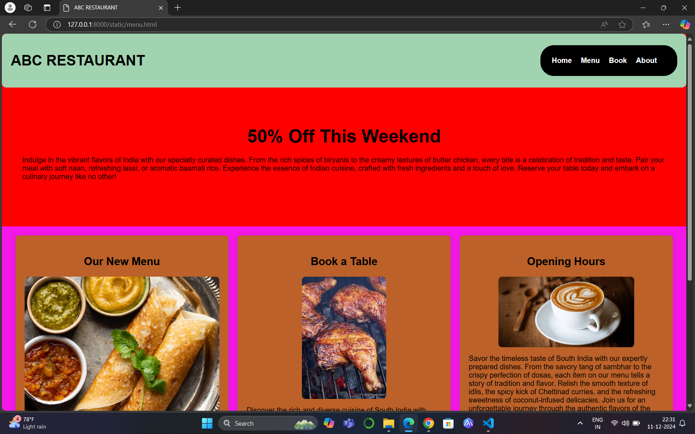
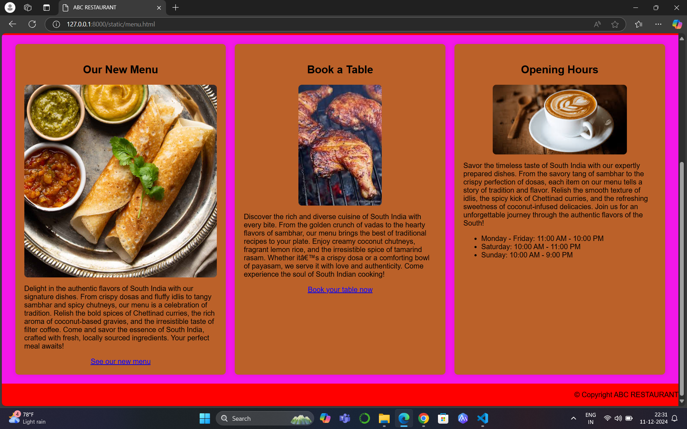

# Ex.07 Restaurant Website
## Date:11-12-2024

## AIM:
To develop a static Restaurant website to display the food items and services provided by them.

## DESIGN STEPS:

### Step 1:
Requirement collection.

### Step 2:
Creating the layout using HTML and CSS.

### Step 3:
Updating the sample content.

### Step 4:
Choose the appropriate style and color scheme.

### Step 5:
Validate the layout in various browsers.

### Step 6:
Validate the HTML code.

### Step 7:
Publish the website in the given URL.

## PROGRAM:
```
<html>
<head>
    <title>ABC RESTAURANT</title>
    <style>
        body 
        {
            font-family: Arial, sans-serif;
            margin: 0;
            padding: 0;
            background-color: red;
        }

        header 
        {
            display: flex;
            justify-content: space-between;
            align-items: center;
            padding: 20px;
            background-color: rgb(162, 211, 176);
            border-radius: 10px;
        }

        .menu 
        {
            background-color: black;
            color: rgb(250, 4, 4);
            padding: 25px;
            border-radius: 30px;
        }

        .logo 
        {
            display: flex;
            align-items: center;
        }

        .logo img 
        {
            width: 50px;
            height: 80px;
            margin-right: 10px;
        }

        nav ul 
        {
            list-style: none;
            display: flex;
            margin: 0;
            padding: 0;
        }

        nav ul li 
        {
            margin-right: 20px;
        }

        .footer 
        {
            padding: 10px 10px;
        }

        nav ul li a 
        {
            text-decoration: none;
            color: white;
            font-weight: bold;
        }

        .offer-txt 
        {
            color: black;
        }

        .hours 
        {
            width: 300px;
            height: 80px;
        }

        .banner 
        {
            text-align: center;
            background: url('banner.jpg') no-repeat center center/cover;
            padding: 60px 20px;
            color: white;
            border-radius: 10px;
            margin: 25px;
        }

        .banner h2 
        {
            font-size: 2.5em;
            margin: 0 0 20px;
        }

        .features 
        {
            display: flex;
            justify-content: space-around;
            padding: 20px;
            background-color: rgb(243, 23, 232);
        }

        .feature 
        {
            text-align: center;
            background-color: rgb(187, 97, 41);
            padding: 20px;
            border-radius: 8px;
            box-shadow: 0 0 10px rgba(0, 0, 0, 0.1);
            flex: 1;
            margin: 0 10px;
        }

        .feature h3 
        {
            font-size: 1.5em;
            margin-bottom: 20px;
        }

        .feature img 
        {
            max-width: 100%;
            height: auto;
            border-radius: 8px;
        }

        p 
        {
            text-align: left;
        }

        ul 
        {
            text-align: left;
        }

        .copy 
        {
            margin-left: auto;
        }

        .hyperlink 
        {
            color: blue;
        }
    </style>
</head>
<body>
    <header>
        <div class="logo">
            <h1>ABC RESTAURANT</h1>
        </div>
        <nav class="menu">
            <ul>
                <li><a href="#">Home</a></li>
                <li><a href="#">Menu</a></li>
                <li><a href="#">Book</a></li>
                <li><a href="#">About</a></li>
            </ul>
        </nav>
    </header>
    <main>
        <section class="banner" style="background-image: url('offer.webp');">
            <h2 class="offer-txt">50% Off This Weekend</h2>
            <p class="offer-txt">Indulge in the vibrant flavors of India with our specially curated dishes. From the rich spices of biryanis to the creamy textures of butter chicken, every bite is a celebration of tradition and taste. Pair your meal with soft naan, refreshing lassi, or aromatic basmati rice. Experience the essence of Indian cuisine, crafted with fresh ingredients and a touch of love. Reserve your table today and embark on a culinary journey like no other!</p>
        </section>
        <section class="features">
            <div class="feature">
                <h3>Our New Menu</h3>
                
                <p>Delight in the authentic flavors of South India with our signature dishes. From crispy dosas and fluffy idlis to tangy sambhar and spicy chutneys, our menu is a celebration of tradition. Relish the bold spices of Chettinad curries, the rich aroma of coconut-based gravies, and the irresistible taste of filter coffee. Come and savor the essence of South India, crafted with fresh, locally sourced ingredients. Your perfect meal awaits!</p>
                <a href="www.google.com">See our new menu</a>
            </div>
            <div class="feature">
                <h3>Book a Table</h3>
                
                <p>Discover the rich and diverse cuisine of South India with every bite. From the golden crunch of vadas to the hearty flavors of sambhar, our menu brings the best of traditional recipes to your plate. Enjoy creamy coconut chutneys, fragrant lemon rice, and the irresistible spice of tamarind rasam. Whether it’s a crispy dosa or a comforting bowl of payasam, we serve it with love and authenticity. Come experience the soul of South Indian cooking!</p>
                <a href="www.google.com">Book your table now</a>
            </div>
            <div class="feature">
                <h3>Opening Hours</h3>
                
                <p>Savor the timeless taste of South India with our expertly prepared dishes. From the savory tang of sambhar to the crispy perfection of dosas, each item on our menu tells a story of tradition and flavor. Relish the smooth texture of idlis, the spicy kick of Chettinad curries, and the refreshing sweetness of coconut-infused delicacies. Join us for an unforgettable journey through the authentic flavors of the South!</p>
                <ul>
                    <li>Monday - Friday: 11:00 AM - 10:00 PM</li>
                    <li>Saturday: 10:00 AM - 11:00 PM</li>
                    <li>Sunday: 10:00 AM - 9:00 PM</li>
                </ul>
            </div>
        </section>
        <footer>
            <div class="logo">
                <p class="copy">&copy; Copyright ABC RESTAURANT</p>
            </div>
        </footer>
    </main>
</body>
</html>

```

## OUTPUT:

 
 
 

## RESULT:
The program for designing software company website using HTML and CSS is completed successfully.
